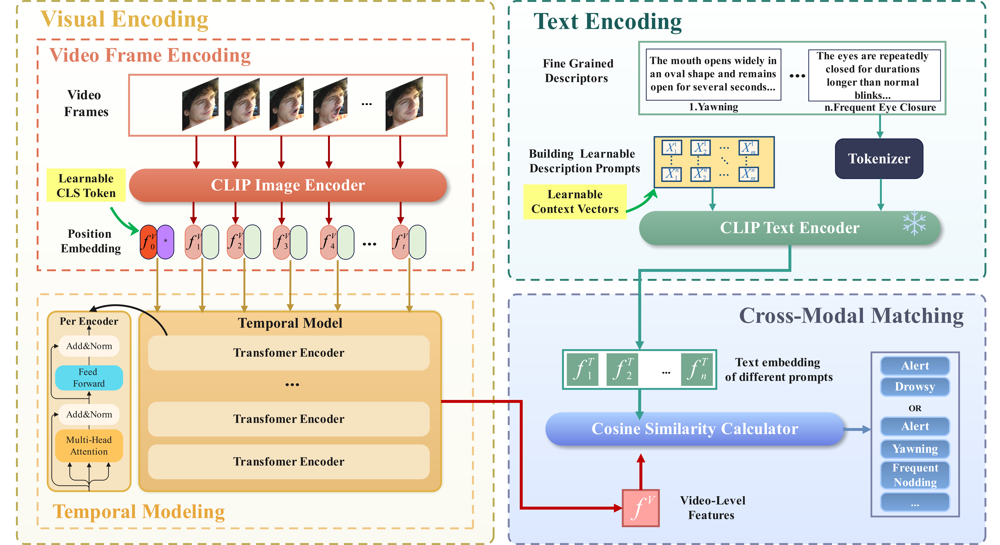

# DFD-CLIP: A Unified Vision-Language Framework for Driving Fatigue Detection with Temporal Modeling and Adaptive Prompt Learning

<p align="center">
    
</p>

### Abstract
This paper proposes an innovative unified vision-language framework for driving fatigue detection, called **DFD-CLIP**, which supports both static image and video inputs while demonstrating strong cross-dataset generalization. Specifically, we restructure CLIP into a temporally enhanced framework by integrating a temporal Transformer module and leveraging learnable class tokens to extract video-level fatigue features. We employ an LLM to generate fine-grained facial behavior descriptions instead of traditional labels and combine them with adaptive prompt learning to enhance semantic representation. Furthermore, a composite loss function incorporating dynamic margin optimization and fine-grained sample weighting is proposed to mitigate classification instability caused by label ambiguity. Experimental results demonstrate that **DFD-CLIP** achieves state-of-the-art performance on multiple public datasets.  

### Setup and Run
```bash
git clone https://github.com/your-username/DFD-CLIP.git
cd DFD-CLIP
pip install -r requirements.txt
./train_RLDD.sh
./train_NTHUDD.sh
./train_YawDD.sh

